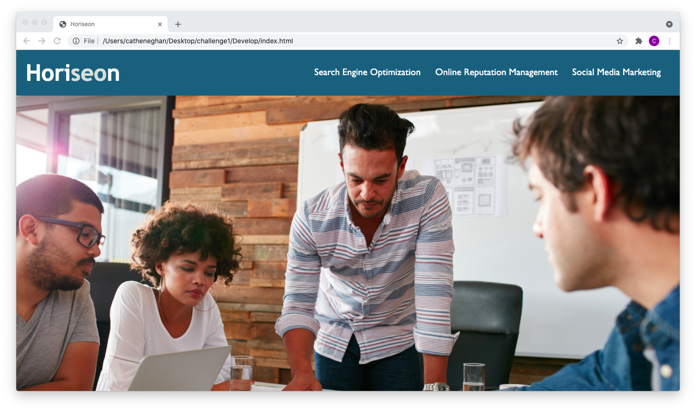
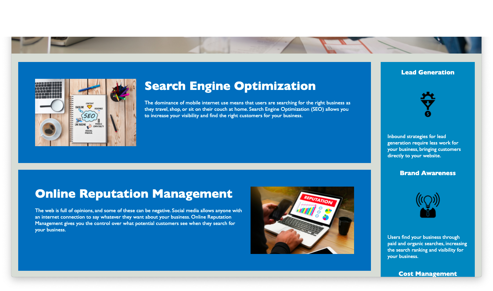
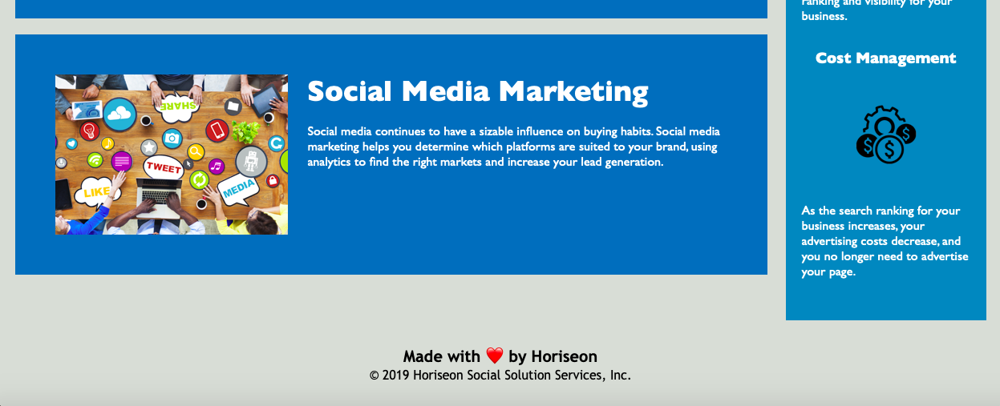

# Horiseon  Homepage

This is a landing webpage for Horiseon, a marketing agency that specializes in improving brands' online presence.

## Goal

The purpose of updating their website was to improve search engine optimization and increase accessibility. 
This was done through using semantic html elements, improving the readibility of the code and adding alternate attributes to the images.

## Screenshot

The page should appear as the following:

## Link

It is published through GitHub Pages at the following [link](https://cat-bh.github.io/horiseon-challenge1/)